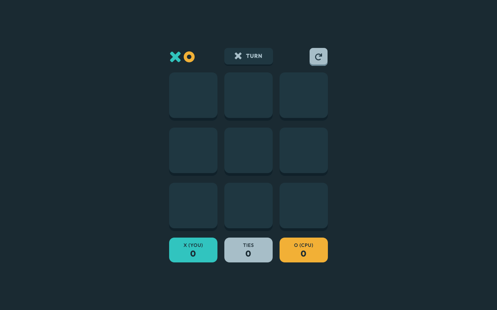

# Frontend Mentor - Tic Tac Toe solution

This is a solution to the [Tic Tac Toe challenge on Frontend Mentor](https://www.frontendmentor.io/challenges/tic-tac-toe-game-Re7ZF_E2v). Frontend Mentor challenges help you improve your coding skills by building realistic projects.

## Table of contents

- [Overview](#overview)
  - [The challenge](#the-challenge)
  - [Screenshot](#screenshot)
  - [Links](#links)
- [My process](#my-process)
  - [Built with](#built-with)
  - [Optimizations](#optimizations)
- [Author](#author)

## Overview

### The challenge

Users should be able to:

- [x] View the optimal layout for the game depending on their device's screen size
- [x] See hover states for all interactive elements on the page
- [x] Play the game either solo vs the computer or multiplayer against another person
- [ ] **Bonus 1**: Save the game state in the browser so that it’s preserved if the player refreshes their browser
- [ ] **Bonus 2**: Instead of having the computer randomly make their moves, try making it clever so it’s proactive in blocking your moves and trying to win

### Screenshot

### Links

- Solution URL: [https://www.frontendmentor.io/solutions/tic-tac-toe-game-using-react-HJ8hvelw5](https://www.frontendmentor.io/solutions/tic-tac-toe-game-using-react-HJ8hvelw5)
- Live Site URL: [https://nakoyawilson-tic-tac-toe.netlify.app/](https://nakoyawilson-tic-tac-toe.netlify.app/)

## My process

### Built with

- [React](https://reactjs.org/) - JS library
- Mobile-first workflow
- Figma Design File

**Note: These are just examples. Delete this note and replace the list above with your own choices**

### Optimizations

- Save the game state in the browser so that it’s preserved if the player refreshes their browser
- Instead of having the computer randomly make their moves, try making it clever so it’s proactive in blocking your moves and trying to win

## Author

- Website - [Nakoya Wilson](https://nakoyawilson.netlify.app/)
- Frontend Mentor - [@nakoyawilson](https://www.frontendmentor.io/profile/nakoyawilson)
- Twitter - [@nakoyawilson](https://twitter.com/nakoyawilson)
- LinkedIn - [@nakoyawilson](https://www.linkedin.com/in/nakoyawilson/)
